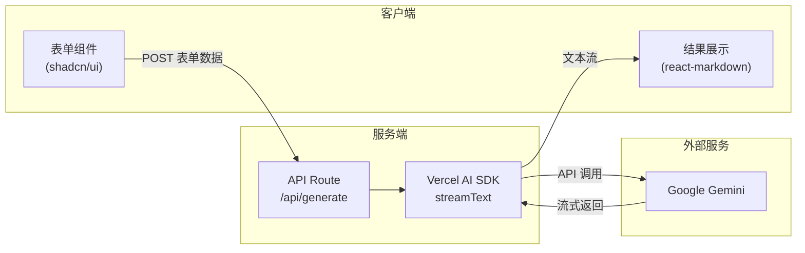

# AI Travel Plan 项目实施计划

## 当前项目状态

- Next.js 16.1.6 + React 19 + Tailwind CSS v4 的空项目
- 无 shadcn/ui、无 API 路由、无 AI SDK

## 架构总览



## 1. 初始化 shadcn/ui

运行 `npx shadcn@latest init -d` 初始化 shadcn/ui（非交互模式），然后修复 Tailwind v4 下的 Geist 字体问题（`@theme inline` 中用字面字体名替换 `var(--font-sans)` 的循环引用，字体变量 className 从 `<body>` 移到 `<html>`）。

安装以下 shadcn 组件：

```bash
npx shadcn@latest add button input label card calendar popover separator
```

## 2. 安装 AI 相关依赖

```bash
npm install ai @ai-sdk/google react-markdown date-fns
```

- `ai` — Vercel AI SDK 核心包
- `@ai-sdk/google` — Google Gemini provider
- `react-markdown` — Markdown 渲染
- `date-fns` — 日期格式化（shadcn calendar 依赖）

## 3. 创建环境变量文件

创建 `[.env.local](.env.local)`，放入 Google API Key：

```env
GOOGLE_GENERATIVE_AI_API_KEY=your_api_key_here
```

## 4. 构建首页表单 — `[app/page.tsx](app/page.tsx)`

将首页改造为旅行计划生成器，包含一个 `Card` 容器，内部表单字段：

| 字段     | 组件                                | 说明                     |
| -------- | ----------------------------------- | ------------------------ |
| 目的地   | `Input`                             | 文本输入                 |
| 旅行天数 | `Input type="number"`               | 数字输入                 |
| 人数     | `Input type="number"`               | 数字输入                 |
| 预算金额 | `Input type="number"`               | 数字输入（单位：元）     |
| 日期范围 | `Calendar mode="range"` + `Popover` | 从哪天到哪天的日历选择器 |
| 生成按钮 | `Button size="lg"`                  | 全宽大按钮，点击调用 API |

该页面标记为 `"use client"`，使用 `useState` 管理表单状态和生成结果。点击按钮后：

1. 将表单数据 POST 到 `/api/generate`
2. 以流式方式读取响应（`ReadableStream` + `TextDecoder`）
3. 实时更新状态，逐步显示 Markdown 结果

结果区域使用 `react-markdown` 渲染，配合 Tailwind prose 类实现美观的排版。

## 5. 创建 API Route — `app/api/generate/route.ts`（新建）

```typescript
import { streamText } from "ai";
import { google } from "@ai-sdk/google";

export async function POST(req: Request) {
  const { destination, days, people, budget, startDate, endDate } =
    await req.json();

  const result = streamText({
    model: google("gemini-2.5-flash"),
    prompt: `作为一个专业旅行规划师，请为以下旅行制定详细计划：
目的地：${destination}
旅行天数：${days}天
人数：${people}人
预算：${budget}元
日期：${startDate} 至 ${endDate}
请用 Markdown 格式输出，包含每日行程、景点推荐、餐饮建议、交通方式、预算分配等。`,
  });

  return result.toTextStreamResponse();
}
```

## 6. 页面布局与样式

- 页面居中布局，最大宽度约 `max-w-2xl`
- 顶部标题区域
- 表单卡片使用 `Card` + `CardHeader` + `CardContent`
- 底部结果区域：加载时显示动画，生成完成后显示格式化 Markdown
- 使用 shadcn 的深色/浅色主题 token（`bg-background`, `text-foreground` 等）
